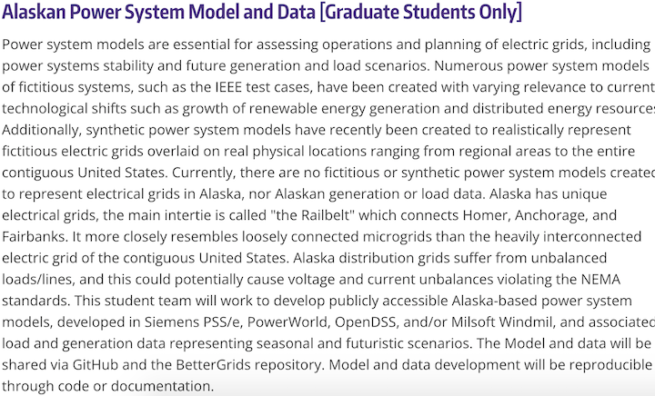

# ACEP_Capstone_Project

## Use Cases and Component Specification - ACEP- group

### Project description from capstone page:

###### Source: University of Washington Engineerging Capstone - https://www.engr.washington.edu/capstone/

### User Stories:

#### Tom is a data scientist works in one of the energy generator/ plant companies. He wants to know how much electricity needs to be generated for a summer festival. Also, what portion should be distributed to the festival area.  Tom is proficient in understanding electrical grids and the usage of electricity.
#### Becky is a student researcher who is working on developing new grids for electricity transmission/distribution. She wants to know the usage patterns in Alaska. She wants an easy-to-understand interface that is publicly accessible.

### Describing Use Case:

#### Info provides by user
#### •	Time, Location
#### Systems response
#### •	Grid graph on map with the expected electricity use, error

### Authenticate User Use Case:
#### User --> Input “time and location”
#### Program --> [Readable] Output plot of the electricity grid
####             [Not Readable] Report error
#### User --> Ask for more data or raw data
#### Program --> [Readable] Output data file  
####	           [Not Readable/ Sensitive data] Report error

### Component Specification:

| Name | What it Does | Input | Output |
|------|--------------|-------|--------|
| Model prepared  | Takes input data | Time, load, location, and weather | Prediction of load in the future use case scenarios |
| Interface| To show prediction and compare using statistical tools from the current usage | Current, voltage, Impedance, Capacitance,Reactants
| Statistical values such as SD, mean and difference in the
prediction and use |
